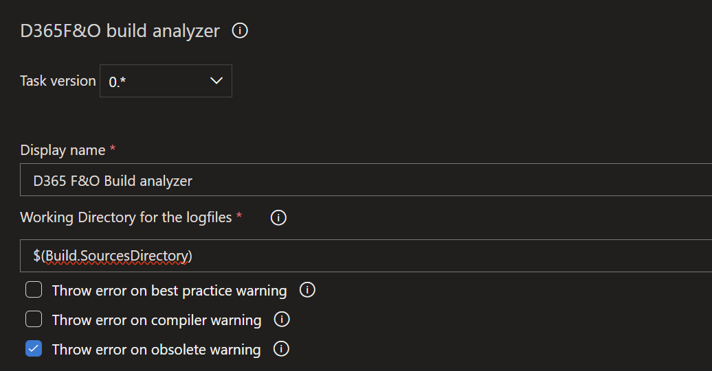
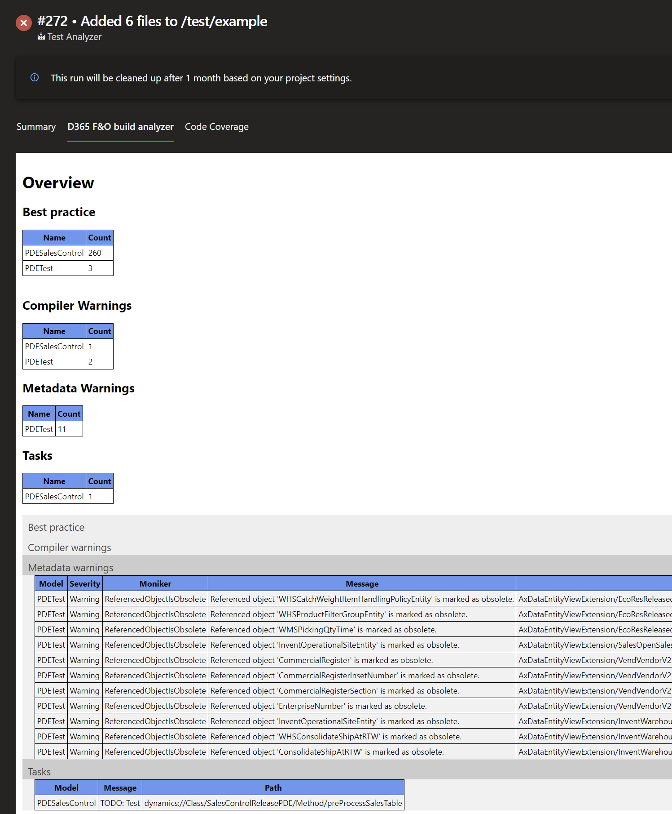

# D365 F&O BuildAnalyzer

Analyzes the output logs of the compiler and best practices for warnings, information, and todos to provide a build summary about them.

If desired, the task will then fail if certain conditions are met. 
Currently, the task has three options:
* Fail on a BP check
* Fail on warnings from the compiler
* Fail on obsolete warnings

# Build results tab
This extension also adds a build results tab to the pipeline results page, where the user can see an overview of how many occurrences of BP, compiler, metadata and todo warnings there are in the models. In addition, all warnings are listed in tables below the summary. 

***Please excuse the basic design of the result page. I'm not a web designer and tried to do my best with my backend developer knowledge.***

